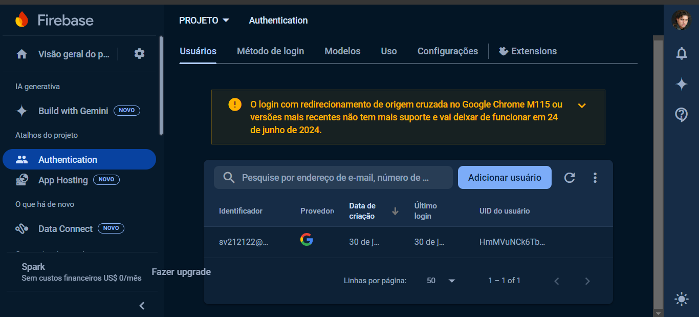

# GOOGLE AUTH FIREBASE
👨‍🏫APP DE AUTENTICACAO DO GOOGLE COM REACT E FIREBASE!

 <br> 
 <br> 

## DESCRIÇÃO:
Este é um app React que permite que os usuários façam login em uma aplicação usando a autenticação do Google via Firebase. Aqui está uma descrição de como ele funciona:

1. **Autenticação com Google**:
   - O componente permite que o usuário faça login usando uma conta do Google.
   - Utiliza o método `signInWithPopup` do Firebase Authentication para autenticar o usuário através de uma janela pop-up.

2. **Exibição de Informações do Usuário**:
   - Após o login, exibe a foto, nome e e-mail do usuário autenticado.

3. **Tratamento de Erros**:
   - Caso ocorra um erro durante o processo de login, ele é registrado no console.

## EXECUTANDO O PROJETO:
1. **Criar o app no Firebase**
   1. **Acesse o Firebase Console**:
      - Vá para [Firebase Console](https://console.firebase.google.com/).

   2. **Crie um Novo Projeto**:
      - Clique em "Adicionar projeto".
      - Dê um nome ao seu projeto e siga as instruções para configurá-lo.
      - Quando solicitado, você pode optar por habilitar o Google Analytics para seu projeto (opcional).

   3. **Configuração do Projeto**:
      - Após a criação do projeto, você será redirecionado para o painel do projeto.
      - Clique no ícone de configurações ao lado do nome do projeto e selecione "Configurações do projeto".
      - No menu de configurações, selecione "Suas apps" e clique no ícone do Firebase para web (</>) para criar um novo app web.
      - Dê um nome ao app e clique em "Registrar app".

   4. **Obter Configuração do Firebase**:
      - Após registrar o app, você verá as configurações do Firebase, incluindo o `apiKey`, `authDomain`, `projectId`, etc.
      - Copie essas informações. Você precisará delas para configurar o Firebase na sua aplicação React.

   5. **Configurar Firebase no Projeto**:
      - Adicione a configuração do Firebase no arquivo `./CODIGO/src/services/firebase.ts`, usando as informações copiadas do console do Firebase. O código deve ser semelhante ao seguinte:
      ```javascript
      // src/services/firebase.ts
      import { initializeApp } from "firebase/app";
      import { getAuth, GoogleAuthProvider } from "firebase/auth";

      const firebaseConfig = {
      apiKey: "SUA_API_KEY",
      authDomain: "SEU_AUTH_DOMAIN",
      projectId: "SEU_PROJECT_ID",
      storageBucket: "SEU_STORAGE_BUCKET",
      messagingSenderId: "SEU_MESSAGING_SENDER_ID",
      appId: "SEU_APP_ID",
      measurementId: "SEU_MEASUREMENT_ID",
      };

      const app = initializeApp(firebaseConfig);
      export const auth = getAuth(app);
      ```

   6. **Configurar Provedores de Autenticação**:
      - No console do Firebase, vá para a seção "Authentication".
      - Clique na guia "Método de login".
      - Ative o provedor do Google clicando em "Google" e habilitando-o. Configure as opções solicitadas e salve as mudanças.

2. **Instalando as Dependências:**
   - Para instalar as dependências listadas no arquivo "package.json", você pode usar o comando `npm install` no terminal. Certifique-se de estar no diretório `CODIGO/`, e execute o seguinte comando:
   ```bash
   npm install
   ```

3. **Executando o Aplicativo:**
   - Para iniciar o servidor, abra o terminal e execute o seguinte comando:
   ```bash
   npm run dev
   ```

   - Acesse o aplicativo no navegador visitando [http://localhost:5173/](http://localhost:5173/).

4. **Interagindo com o Aplicativo:**
   - **Autenticação com o Google**: Clique no botão `SignIn with Google` para iniciar o processo de autenticação. Isso abrirá uma janela pop-up onde você poderá fazer login com sua conta Google. Após a autenticação bem-sucedida, suas informações de usuário serão exibidas na aplicação.

## NÃO SABE?
- Entendemos que para manipular arquivos em `HTML`, `CSS` e outras linguagens relacionadas, é necessário possuir conhecimento nessas áreas. Para auxiliar nesse aprendizado, oferecemos cursos gratuitos disponíveis:
* [CURSO DE HTML E CSS](https://github.com/VILHALVA/CURSO-DE-HTML-E-CSS)
* [CURSO DE SCSS](https://github.com/VILHALVA/CURSO-DE-SCSS)
* [CURSO DE TYPESCRIPT](https://github.com/VILHALVA/CURSO-DE-TYPESCRIPT)
* [CURSO DE NODEJS](https://github.com/VILHALVA/CURSO-DE-NODEJS)
* [CURSO DE REACT](https://github.com/VILHALVA/CURSO-DE-REACT)
* [CONFIRA MAIS CURSOS](https://github.com/VILHALVA?tab=repositories&q=+topic:CURSO)

## CREDITOS:
- [PROJETO CRIADO PELO "orodrigogo"](https://github.com/orodrigogo/google-auth-reactjs)
- [VEJA O VIDEO DESSE PROJETO](https://youtu.be/7Gd8an7qZ4w?si=fDbgnEuolMbxIzG8)
- [PROJETO EDITADO PELO VILHALVA](https://github.com/VILHALVA)


